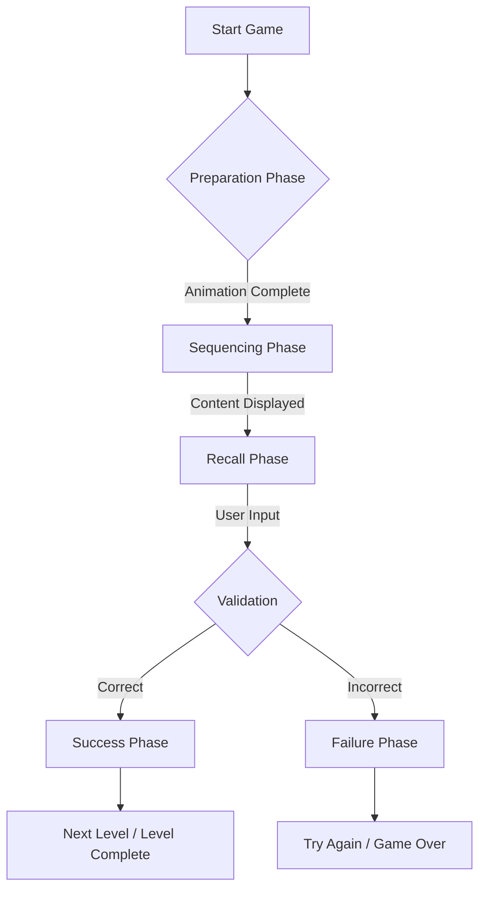

# miToosa 🧠 — Cognitive Excellence Puzzle Game


[](https://flutter.dev)
[](https://dart.dev)
[](https://flutter.dev)
[](https://opensource.org/licenses/MIT)
[](https://github.com/sky2464/miToosa/actions/workflows/pr-validation.yml)

**miToosa** is a next-generation, dopamine-driven cognitive puzzle game designed to sharpen pattern recognition, memory, and IQ. Built with a **2026-native aesthetic**, it focuses on short, high-impact sessions that provide immediate neurological feedback using the **Aetheric Pulse** design system.

---

## ✨ Neuro-Feedback Features

- **ADHD-Optimized Flow**: Ultra-fast transitions and a unique "Preparation -> Sequence -> Recall" loop designed for maximum engagement.
- **Aetheric Pulse Design**: A premium visual language featuring glassmorphism, glowing neon accents, and microscopic haptic feedback.
- **Dopamine Loop**: Real-time rewards like "IQ +1!", "Memory Boost!", and "Synapse Connected!" for every puzzle solved.
- **Dynamic Difficulty**: Randomized track lengths (8-28 levels) and a progressive complexity curve that adapts to your performance.
- **Cross-Platform Native**: High-performance experience across iOS, Android, macOS, and Web.

---

## 🚀 Getting Started

### Prerequisites

- [Flutter SDK](https://docs.flutter.dev/get-started/install) (>= 3.5.0)
- [Java Development Kit (JDK)](https://adoptium.net/temurin/releases/?version=21) (Java 21 recommended for modern Android builds)
- [Xcode](https://developer.apple.com/xcode/) (for iOS/macOS builds)
- [Android Studio](https://developer.android.com/studio) & Android SDK/NDK

### 🛠 Installation

1. **Clone & Enter**:

   ```bash
   git clone https://github.com/sky2464/miToosa.git
   cd miToosa
   ```

2. **Install Dependencies**:

   ```bash
   flutter pub get
   ```

3. **Generate Code**:

   miToosa uses code generation for state management and local persistence. **This step is mandatory before the first build:**

   ```bash
   dart pub run build_runner build --delete-conflicting-outputs
   ```

---

## 📱 Running the App

### 🍎 iOS & iPadOS (macOS required)

1. **Launch the Simulator**:

   ```bash
   open -a Simulator
   ```

2. **Run the App**:

   ```bash
   flutter run -d iPhone
   # or for specific device IDs:
   flutter run -d <DEVICE_ID>
   ```

### 🤖 Android

1. Start an emulator via Android Studio or connect a physical device.
2. Verify connection: `flutter devices`
3. **Run**:

   ```bash
   flutter run
   ```

### 🌐 Web

Run the app in your local browser (Chrome/Edge):

```bash
flutter run -d chrome
```

### 💻 macOS (Desktop)

Run as a native desktop application:

```bash
flutter run -d macos
```

---

## 📂 Pulse Architecture

miToosa follows a reactive, domain-driven architecture focused on pure state transitions.

### The Gameplay Loop (Mermaid)



### Project Structure

- **`lib/core/engine`**: The logic layer managing the `GameplayEngine` and its phases.
- **`lib/features/gameplay`**: High-performance UI components synchronized via **Riverpod**.
- **`lib/data`**: Repository layers and Hive database adapters for player progress.
- **`lib/theme`**: The **Aetheric Pulse** design system (tokens, glassmorphism utilities).

---

## 🧪 Testing & Quality

We maintain a robust core to ensure puzzle integrity.

### Run Engine Tests

Verify domain logic and phase transitions:

```bash
flutter test test/core/engine/gameplay_engine_test.dart
```

### Static Analysis

Ensure code quality and style compliance:

```bash
dart analyze
```

---

## 🛠 Tech Stack

- **Framework**: [Flutter](https://flutter.dev)
- **State Management**: [Riverpod](https://riverpod.dev) + [Riverpod Generator](https://pub.dev/packages/riverpod_generator)
- **Database**: [Hive](https://pub.dev/packages/hive)
- **Audio Engine**: [Audioplayers](https://pub.dev/packages/audioplayers)
- **Fonts**: Space Grotesk (Headers), Manrope (Body)
- **Fonts**: Space Grotesk (Headers), Manrope (Body)

---

## 🤝 Contributing — Git & PR workflow

Contributors: use this simple Git branch and Pull Request workflow to create short-lived branches, open PRs for review, merge into `main`, and clean up branches.

### Create a PR branch

1. Start from an up-to-date `main`:

```bash
git fetch origin
git checkout -b chore/your-branch-name origin/main
```

2. Make changes, commit, and push:

```bash
git add .
git commit -m "chore: short description of changes"
git push -u origin chore/your-branch-name
```

### Open a Pull Request

Option A — GitHub web: open a new PR at https://github.com/sky2464/miToosa/pulls.

Option B — GitHub CLI:

```bash
gh auth login   # first-time only
gh pr create --base main --head chore/your-branch-name --fill
```

Use a clear title (include a prefix like `feature/`, `fix/`, `chore/`) and describe the change. Link related issues if any.

### Merge to `main` and delete the branch

Once the PR is approved and CI is green, merge using GitHub (Squash merge is recommended) or via the CLI:

```bash
# Squash & merge via gh and delete the remote branch
gh pr merge --squash --delete-branch

# Or merge locally and push
git checkout main
git pull origin main
git merge --no-ff chore/your-branch-name
git push origin main

# Delete local branch
git branch -d chore/your-branch-name

# If needed, delete remote branch
git push origin --delete chore/your-branch-name
```

### Quick tips

- Keep branches small and focused (one feature/bug per branch).
- Rebase on `main` before pushing large changes:

```bash
git fetch origin
git rebase origin/main
git push --force-with-lease
```

- Run code generation or build steps locally before opening a PR:

```bash
dart pub run build_runner build --delete-conflicting-outputs
```

This helps reviewers reproduce and verify changes quickly.

## 📄 License

This project is licensed under the MIT License - see the [LICENSE](LICENSE) file for details.
