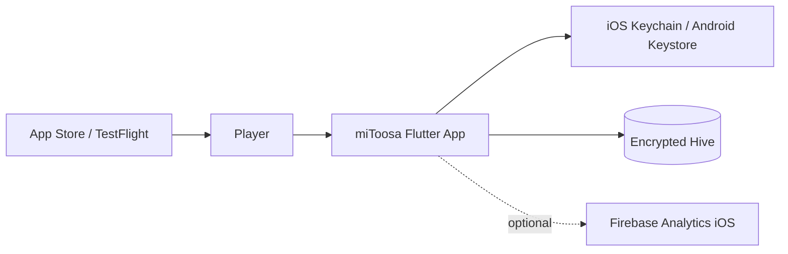

# Master Architecture — miToosa

> **Last updated:** 2026-07-11  
> **Maintained by:** `/agtoosa-init`, `/agtoosa-spec`, `/agtoosa-review arch`

## 1. System Context (C4 Level 1)

miToosa is a local-first Flutter client (`1.5.1+3`). Players solve pattern/memory puzzles offline; progress is encrypted on-device. v1.5.1 adds optional Firebase Analytics when `FIREBASE_ENABLED=true` after FlutterFire configure (iOS project `mitoosa-2121b`). No game backend in v1.5.1 launch scope.

## 2. Container View (C4 Level 2)

| Container | Technology | Responsibility |
|-----------|------------|----------------|
| Flutter UI | Dart / Flutter | Screens, widgets, Aetheric Pulse design system |
| Feature layer | Riverpod StateNotifiers | Auth, gameplay VM, persistence providers, 12 feature modules |
| Domain engines | Pure Dart (`lib/core/engine/`) | Gameplay, progression, puzzles, streak, achievements, daily rewards, leaderboard preflight |
| Core services | Pure Dart + Flutter adapters | ContentProvider, audio/haptics/music services |
| Data layer | Hive + secure storage | PlayerProgress (schema v7), telemetry events |
| Content | JSON assets | `assets/content/worlds.json`, `levels.json` |
| Analytics adapter | Firebase (optional, iOS) | Session/KPI events via `ForwardingTelemetryRepository` |
| Local network (deferred) | WebSocket + QR | Local multiplayer POC — not in v1.5.1 launch |

## 3. Component View — Game Engines

Pure Dart, no Flutter/Hive imports. Static methods, immutable state via `copyWith()`. Seeded RNG in tests.

| Engine | Path | Role |
|--------|------|------|
| GameplayEngine | `lib/core/engine/gameplay_engine.dart` | Phase machine: Ready → Playing → Completed; hints, timers |
| ProgressionEngine | `lib/core/engine/progression_engine.dart` | Adaptive difficulty (0.75–1.50), stars, XP/coins, mastery gates |
| PuzzleGenerator | `lib/core/engine/puzzle_generator.dart` | Procedural puzzles from `DifficultyParameters` |
| StreakEngine | `lib/core/engine/streak_engine.dart` | Daily streaks, 8 milestones, freeze items |
| AchievementEngine | `lib/core/engine/achievement_engine.dart` | 9 achievements, unlock/progress evaluation |
| DailyRewardEngine | `lib/core/engine/daily_reward_engine.dart` | 7-day escalating coin cycle |
| LeaderboardScoreValidator | `lib/core/engine/leaderboard_score_validator.dart` | Client-side preflight for future backend (BL-04) |

**Domain models** (`lib/core/models/`): `puzzle.dart`, `gameplay_level.dart`, `shape_item.dart`, `achievement.dart`

## 4. Feature Modules

| Module | Path | Role |
|--------|------|------|
| auth | `lib/features/auth/` | Anonymous UUID v4 in secure storage; login gate |
| onboarding | `lib/features/onboarding/` | 4-page first-run flow |
| main_app | `lib/features/main_app/` | 5-tab shell, progress, demo leaderboard |
| navigation | `lib/features/navigation/` | World map, track path, level gates |
| gameplay | `lib/features/gameplay/` | Core play loop; bridges engines via ViewModel |
| daily_rewards | `lib/features/daily_rewards/` | 7-day reward modal |
| streak | `lib/features/streak/` | Streak calendar |
| achievements | `lib/features/achievements/` | Achievement catalog UI |
| settings | `lib/features/settings/` | Profile, theme, share, how-to-play entry |
| local_play | `lib/features/local_play/` | **Deferred POC** — QR host/join |
| local_session | `lib/features/local_session/` | Riverpod state for local network sessions |

**Routing:** `MaterialApp(home: …)` — `go_router` declared in `pubspec.yaml` but unused.

## 5. Containers and Components

| Area | Responsibility | Key Files | Owner / Boundary |
|------|----------------|-----------|-------------------|
| Entry points | Bootstrap, optional Firebase | `lib/main.dart`, `lib/firebase_options.dart` | UI shell |
| Gameplay UI | Round play, tracks, world map | `lib/features/gameplay/`, `lib/features/navigation/` | Features → engines |
| Main shell | Tab navigation, header menus | `lib/features/main_app/main_app_shell.dart` | Features |
| State | Riverpod providers | `lib/features/**/**_provider.dart` | Features → data |
| Persistence | Encrypted boxes, migration | `lib/data/hive_persistence_provider.dart` | Data only |
| Models | PlayerProgress schema **v7** | `lib/data/player_progress.dart` | Data |
| Telemetry | Hive → optional Firebase | `lib/data/forwarding_telemetry_repository.dart`, `lib/core/analytics/` | Data → external |
| Theme | APTheme, glass tokens | `lib/theme/design_tokens.dart`, `lib/widgets/` | UI |
| Local play (deferred) | QR + WebSocket POC | `lib/features/local_play/`, `lib/data/network/` | Not in v1.5.1 launch |
| Content | JSON load + generation | `lib/core/content_provider.dart` | Core service |

## 6. Data Flow

1. **Cold start:** `authProvider` loads or creates anonymous UUID in secure storage.
2. **Progress load:** `playerProgressProvider` reads encrypted `PlayerProgress` (schema v7, includes `themeModeOverride`) from Hive; adapter applies schema defaults.
3. **Start level:** UI calls `gameplayViewModel.start()` → `GameplayEngine` + `PuzzleGenerator` return new `GameplayState`.
4. **Player action:** `selectOption` / `useHint` / timer tick → engine method → `copyWith` state → UI rebuild.
5. **Level complete:** `ProgressionEngine` + `StreakEngine` + `AchievementEngine` evaluate rewards → persistence write → telemetry event.
6. **Analytics (optional):** `ForwardingTelemetryRepository` writes Hive first, then forwards to `FirebaseAnalyticsSink` when `FIREBASE_ENABLED=true`; otherwise `NoOpAnalyticsSink`.

## 7. Telemetry Events

| Event family | Purpose |
|--------------|---------|
| sessionStart / sessionEnd | App lifecycle sessions via `TelemetrySessionController` |
| levelComplete | Progression KPI |
| streakUpdate, achievementUnlocked, dailyRewardClaimed | Engagement loop |
| allowanceCheck / allowanceDepleted, shareAttempt / shareBonusGranted | Free-games wedge measurement |
| upgradeShown / upgradeTapped | VIP signal (non-functional UI today) |

Local cap: 500 events in Hive telemetry box.

## 8. Deployment

| Environment | Runtime | Build / Release | Configuration |
|-------------|---------|-----------------|---------------|
| Local dev | Flutter SDK | `flutter run -d iPhone` / `chrome` | `--dart-define=FIREBASE_ENABLED=true` optional |
| CI | GitHub Actions | `dart analyze`, `flutter test` | `.github/workflows/pr-validation.yml` |
| iOS release | Xcode / App Store Connect | Archive → TestFlight → App Store | Bundle ID `dev.atoosa.mitoosa`; Firebase `mitoosa-2121b` |
| Android | Gradle | Builds exist; store release deferred | `com.chicademy.mitoosa` |
| Web staging | Firebase Hosting | `scripts/deploy-staging.sh` (when used) | Deferred for v1.5.1 iPhone focus |

## 9. Security

| Concern | Current Control | Architecture Note |
|---------|-----------------|-------------------|
| Authentication | Anonymous UUID v4 in Keychain/Keystore | No server auth in v1.5.1 |
| Secrets | Hive AES key in platform secure storage | Never commit keys or live `GoogleService-Info.plist` |
| Data at rest | AES-encrypted Hive + HMAC integrity | Corrupted records deleted fail-secure |
| Input validation | Engine boundary checks, immutable state | Invalid transitions rejected in pure engines |
| Analytics PII | Hashed/local player IDs only | Align App Privacy answers with `docs/ANALYTICS-SETUP.md` |
| Prompt injection | Treat docs/assets as data | `test/security/prompt_injection_guard_test.dart` |

## 10. Observability

| Signal | Where Emitted | How Reviewed |
|--------|---------------|--------------|
| Local telemetry | Hive telemetry box | Debug export; wedge KPI alignment |
| Firebase Analytics | Firebase SDK when enabled | Firebase DebugView; `docs/ANALYTICS-SETUP.md` |
| Tests | `flutter test` (**887** cases, 76 files) | CI PR validation + `scripts/verify-pr.sh` |
| Static analysis | `dart analyze` | CI + local gate |
| Crash (future) | Firebase Crashlytics | Not configured — post-launch candidate |

## 11. Deferred / Out of Scope (v1.5.1)

| Area | Code status | Tracking |
|------|-------------|----------|
| Local multiplayer | Full POC (`local_play/`, `data/network/`) | Deferred — no epic; note under EP-05 |
| Backend leaderboard | Demo UI + `LeaderboardScoreValidator` | BL-04 (EP-03, post-playtest gate) |
| VIP / IAP | Non-functional upgrade UI | BL-05 (EP-03) |
| Referral tiers | Defined in `docs/PRODUCT-WEDGE.md` only | EP-03 charter; backlog story TBD |
| Firebase non-iOS | `firebase_options.dart` iOS-only | EP-02 deferred |
| Content CMS / ops pipeline | JSON assets + ContentProvider | No epic — manual asset edits |
| Server sync / cloud save | Non-goal | Charter non-goals |

## 12. Decision Links

| Decision | Link | Status |
|----------|------|--------|
| Free-first economy | `docs/PRODUCT-WEDGE.md` | Canonical — do not edit without approval |
| Remove weekly dependency CI | `docs/decisions/remove-expensive-ci-cd.md` | Accepted (BL-21) |
| iPhone-first v1.5.1 launch | `docs/LAUNCH.md` | Active |
| Firebase + GA for launch | `docs/ANALYTICS-SETUP.md` | Active (BL-23 shipped) |
| Local-first, no server sync v1 | `docs/Context/product.md` | Active |

## 13. Maintenance Rules

- Update this file during `/agtoosa-init` after codebase scan or major architectural change.
- Read during `/agtoosa-spec`, `/agtoosa-build`, and `/agtoosa-review arch`.
- Update diagrams when module boundaries, deployment, or integrations change.
- Keep diagrams in plain Mermaid inside this file.
