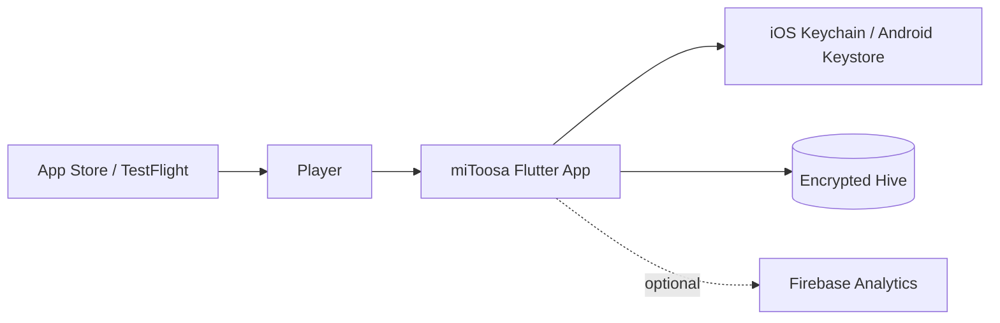

# Master Architecture — miToosa

> **Last updated:** 2026-06-11  
> **Maintained by:** `/agtoosa-init`, `/agtoosa-spec`, `/agtoosa-review arch`

## 1. System Context (C4 Level 1)

miToosa is a local-first Flutter client. Players solve pattern/memory puzzles offline; progress is encrypted on-device. v1.5.0 adds optional Firebase Analytics when `FIREBASE_ENABLED=true` after FlutterFire configure. No game backend in v1.5.0.

## 2. Container View (C4 Level 2)

| Container | Technology | Responsibility |
|-----------|------------|----------------|
| Flutter UI | Dart / Flutter | Screens, widgets, Aetheric Pulse design system |
| Feature layer | Riverpod StateNotifiers | Auth, gameplay VM, persistence providers |
| Domain engines | Pure Dart (`lib/core/engine/`) | Gameplay, progression, streak, achievements |
| Data layer | Hive + secure storage | PlayerProgress, telemetry events |
| Content | JSON assets | `worlds.json`, `levels.json` |
| Analytics adapter | Firebase (optional) | Session/KPI events when enabled |

## 3. Component View — Game Engines

Pure Dart, no Flutter/Hive imports. Static methods, immutable state via `copyWith()`.

| Engine | Path | Role |
|--------|------|------|
| GameplayEngine | `lib/core/engine/gameplay_engine.dart` | Phase machine: Ready → Playing → Completed |
| ProgressionEngine | `lib/core/engine/progression_engine.dart` | Adaptive difficulty, stars, XP/coins |
| StreakEngine | `lib/core/engine/streak_engine.dart` | Daily streaks, milestones, freezes |
| AchievementEngine | `lib/core/engine/achievement_engine.dart` | 9 achievements, unlock evaluation |

## 4. Containers and Components

| Area | Responsibility | Key Files | Owner / Boundary |
|------|----------------|-----------|------------------|
| Entry points | App bootstrap, routing | `lib/main.dart`, `lib/app.dart` | UI shell |
| Gameplay UI | Round play, tracks, world map | `lib/features/gameplay/`, `lib/features/navigation/` | Features → engines |
| Main shell | Tab navigation, header menus | `lib/features/main_app/main_app_shell.dart` | Features |
| State | Riverpod providers | `lib/features/**/**_provider.dart` | Features → data |
| Persistence | Encrypted boxes, migration | `lib/data/hive_persistence_provider.dart` | Data only |
| Models | PlayerProgress schema v6 | `lib/data/models/player_progress.dart` | Data |
| Telemetry | Local events + optional Firebase | `lib/data/telemetry/` | Data → external |
| Theme | APTheme, glass tokens | `lib/theme/design_tokens.dart`, `lib/widgets/glass_card.dart` | UI |
| Local play (deferred) | QR session POC | `lib/features/local_play/` | Not in v1.5.0 launch |

## 5. Data Flow

1. **Cold start:** `authProvider` loads or creates anonymous UUID in secure storage.
2. **Progress load:** `playerProgressProvider` reads encrypted `PlayerProgress` from Hive; adapter applies schema defaults.
3. **Start level:** UI calls `gameplayViewModel.start()` → `GameplayEngine` returns new `GameplayState`.
4. **Player action:** `selectOption` / `useHint` / timer tick → engine method → `copyWith` state → UI rebuild.
5. **Level complete:** `ProgressionEngine` + `StreakEngine` + `AchievementEngine` evaluate rewards → persistence write → telemetry event.
6. **Analytics (optional):** If `FIREBASE_ENABLED`, telemetry repository forwards events to Firebase.

## 6. Deployment

| Environment | Runtime | Build / Release | Configuration |
|-------------|---------|-----------------|---------------|
| Local dev | Flutter SDK | `flutter run -d iPhone` / `chrome` | `--dart-define=FIREBASE_ENABLED=true` optional |
| CI | GitHub Actions | `dart analyze`, `flutter test` | `.github/workflows/pr-validation.yml` |
| iOS release | Xcode / App Store Connect | Archive → TestFlight → App Store | Bundle ID `dev.atoosa.mitoosa`; see `docs/RELEASE-SIGNING.md` |
| Web staging | Firebase Hosting | `scripts/deploy-staging.sh` (when used) | Deferred for v1.5.0 iPhone focus |

## 7. Security

| Concern | Current Control | Architecture Note |
|---------|-----------------|-------------------|
| Authentication | Anonymous UUID v4 in Keychain/Keystore | No server auth in v1.5.0 |
| Secrets | Hive AES key in platform secure storage | Never commit keys or `GoogleService-Info.plist` with secrets |
| Data at rest | AES-encrypted Hive + HMAC integrity | Corrupted records deleted fail-secure |
| Input validation | Engine boundary checks, immutable state | Invalid transitions rejected in pure engines |
| Analytics PII | Hashed/local player IDs only | Align App Privacy answers with `docs/ANALYTICS-SETUP.md` |
| Prompt injection | Treat docs/assets as data | AgToosa security rules in `Docs/AgToosa_Agent.md` |

## 8. Observability

| Signal | Where Emitted | How Reviewed |
|--------|---------------|--------------|
| Local telemetry | Hive telemetry box | Export/debug tooling; future backend |
| Firebase Analytics | Firebase SDK when enabled | Firebase DebugView; `docs/ANALYTICS-SETUP.md` |
| Tests | `flutter test` (882) | CI PR validation |
| Static analysis | `dart analyze` | CI + local gate |
| Crash (future) | Firebase Crashlytics scaffold | Post-configure |

## 9. Decision Links

| Decision | Link | Status |
|----------|------|--------|
| Free-first economy | `docs/PRODUCT-WEDGE.md` | Canonical — do not edit without approval |
| Remove weekly dependency CI | `docs/decisions/remove-expensive-ci-cd.md` | Accepted (BL-21) |
| iPhone-only v1.5.0 launch | `docs/LAUNCH.md` | Active |
| Firebase + GA for launch | `docs/ANALYTICS-SETUP.md` | Active |
| Local-first, no server sync v1 | `docs/Context/product.md` | Active |

## 10. Maintenance Rules

- Update this file during `/agtoosa-init` after codebase scan or major architectural change.
- Read during `/agtoosa-spec`, `/agtoosa-build`, and `/agtoosa-review arch`.
- Update diagrams when module boundaries, deployment, or integrations change.
- Keep diagrams in plain Mermaid inside this file.
