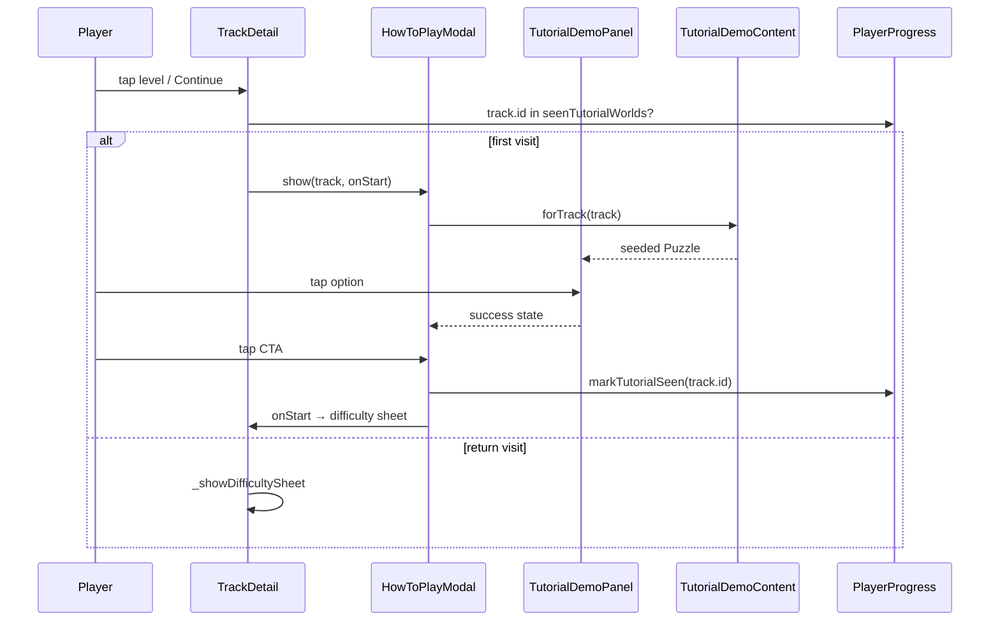

# Spec: BL-24 — Interactive How-To Demos

> **Story ID:** BL-24  
> **Epic:** EP-04 User Experience Polish  
> **Status:** 🟦 Todo  
> **Estimate:** M  
> **Spec created:** 2026-06-14

## 1. Requirements

### 1.1 Goal Contract

| Field | Value |
|-------|-------|
| Goal | Replace static per-track how-to copy with a short interactive tap-through demo so new players learn each track's mechanic before spending a heart |
| User outcome | First-time track entrants understand what to tap; returning players can reopen the demo from gameplay without penalty |
| Success condition | First entry into any unseen track shows interactive demo; correct demo tap shows success feedback; CTA proceeds to difficulty/gameplay; `seenTutorialWorlds` persists; widget + integration tests green |
| Proof / evidence | `test/widgets/tutorial_demo_panel_test.dart`, `test/widgets/how_to_play_modal_test.dart`, `test/features/navigation/track_detail_tutorial_test.dart`; `dart analyze` clean; `flutter test` green |
| Non-goals | Global onboarding rewrite; timer/hearts in demo; video/GIF tutorials; backend analytics events; App Privacy questionnaire (separate backlog item) |
| Assumptions | Interactive demo = one easy seeded puzzle per track (tap correct option → success → CTA). All 23 tracks covered via `PuzzleGenerator(Random(trackSeed))` per ADR-0001. First-entry trigger belongs on track play path (`TrackDetailScreen`), not only `WorldMapScreen`. |
| Risks | Demo UI overflow on small iPhones; generator drift changes demo puzzles; unwired `seenTutorialWorlds` (brownfield gap) delays value until navigation wiring ships |
| Unresolved questions | Settings → "How to play" hub (Should AC — may defer if timeboxed). Cycle enrollment vs BL-23 blocked work (owner decision at approval). |

### 1.2 Brownfield Baseline

| Area | Current state | Intended delta |
|------|---------------|----------------|
| `HowToPlayModal` | Static icon, name, subtitle, CTA | Embeds interactive `TutorialDemoPanel` with tap feedback |
| First-entry trigger | **Not wired** — `seenTutorialWorlds` written only in tests; `TrackDetailScreen` goes straight to difficulty sheet | Check `seenTutorialWorlds` before `_showDifficultySheet`; show modal; `markTutorialSeen` on CTA |
| Gameplay `?` button | Reopens static modal | Reopens interactive modal (no `markTutorialSeen` side effect) |
| Settings | No "How to play" row (design mock has one) | Optional row opens demo for featured/first track |
| Tests | `how_to_play_modal_test.dart` covers static fields | Extended for demo interaction + track entry integration |

**Drift evidence:** `docs/archived/spec-engagement-loop-v1.md` AC marked done for WorldMap first-entry, but `lib/features/navigation/track_detail_screen.dart` has no `HowToPlayModal` import. Resolution: implement on current navigation path (`TrackDetailScreen`).

**Claim boundary:** Tutorial persistence is agent-instructed via existing Hive `PlayerProgress` field; no new schema version required.

### 1.3 User Stories

**As a** new player entering a track for the first time, **I want** a short interactive demo that shows me what to tap **so that** I do not waste a heart learning the rule.

**As a** returning player, **I want** to reopen the how-to demo from gameplay **so that** I can refresh the rule without leaving the level.

**As a** player on a small screen, **I want** the demo modal to scroll if needed **so that** all controls remain reachable.

### 1.4 Acceptance Criteria (EARS)

| ID | EARS | Priority |
|----|------|----------|
| AC-001 | WHEN a player starts a level on a track not in `seenTutorialWorlds` THE SYSTEM SHALL show `HowToPlayModal` with an interactive demo before the difficulty sheet. | Must |
| AC-002 | WHEN the player taps the correct demo option THE SYSTEM SHALL show inline success feedback and enable the primary CTA. | Must |
| AC-003 | WHEN the player taps an incorrect demo option THE SYSTEM SHALL show inline retry feedback without closing the modal. | Must |
| AC-004 | WHEN the player taps the demo CTA after success THE SYSTEM SHALL call `markTutorialSeen(track.id)`, dismiss the modal, and continue to the difficulty selection flow. | Must |
| AC-005 | WHEN a player re-enters a track already in `seenTutorialWorlds` THE SYSTEM SHALL skip the demo and proceed directly to difficulty selection. | Must |
| AC-006 | WHEN the player taps the gameplay header `?` control THE SYSTEM SHALL reopen the interactive demo without mutating `seenTutorialWorlds`. | Must |
| AC-007 | WHILE the demo is active THE SYSTEM SHALL NOT start puzzle timers, deduct hearts, or record gameplay telemetry events. | Must |
| AC-008 | FOR EACH track in `assets/content/worlds.json` THE SYSTEM SHALL produce a deterministic easy demo puzzle from `TutorialDemoContent.forTrack(track)`. | Must |
| AC-009 | WHEN the demo modal is shown on a 320pt-wide viewport THE SYSTEM SHALL remain scrollable without layout overflow. | Should |
| AC-010 | WHEN the player opens Settings THE SYSTEM SHALL offer a "How to play" row that opens the interactive demo for the featured track. | Should |
| AC-011 | THE SYSTEM SHALL expose semantic labels on demo options and the CTA for VoiceOver. | Should |

### 1.5 Out of Scope

- Rewriting the 4-page global onboarding (`onboarding_screen.dart`)
- Per-level tutorials or multi-step coach marks
- Analytics events for tutorial completion
- App Store App Privacy questionnaire (deferred; not BL-24)
- Extracting full gameplay option UI into a shared package (minimal duplication acceptable in `TutorialDemoPanel`)
- Localized copy beyond existing English strings

### 1.6 Failure Modes (Must ACs)

| AC | Failure mode | Mitigation |
|----|--------------|------------|
| AC-001 | Modal never shows; players skip learning | Integration test on `TrackDetailScreen` tap path |
| AC-002 | CTA enabled before success | Widget test asserts CTA disabled until correct tap |
| AC-003 | Wrong tap dismisses modal | Widget test: incorrect tap keeps modal open |
| AC-004 | `seenTutorialWorlds` not persisted | Integration test with mock persistence |
| AC-005 | Demo shows every entry | Test with pre-seeded `seenTutorialWorlds` |
| AC-006 | Reopen marks seen again | Test `?` path does not call `markTutorialSeen` |
| AC-007 | Timer/heart side effects | Demo panel has no gameplay VM/provider coupling |
| AC-008 | Nondeterministic demos break tests | `TutorialDemoContent` unit tests with fixed track ids |
| AC-009 | Overflow on SE | Widget test at 320×568 with `scrollable` modal body |

## 2. Design

### 2.1 Architecture Blueprint

```
lib/core/tutorial_demo_content.dart     # Seeded puzzle factory (pure Dart)
lib/widgets/tutorial_demo_panel.dart    # Tap options + feedback (Flutter)
lib/widgets/how_to_play_modal.dart      # Modal chrome + embed panel + CTA gating
lib/features/navigation/track_detail_screen.dart  # First-entry gate + markTutorialSeen
lib/features/gameplay/gameplay_screen.dart        # ? button → interactive modal
lib/features/settings/settings_screen.dart        # Should: How to play row
test/widgets/tutorial_demo_panel_test.dart
test/widgets/how_to_play_modal_test.dart          # extend
test/features/navigation/track_detail_tutorial_test.dart
test/core/tutorial_demo_content_test.dart
```

**Data flow:**



**Module boundaries:**

- `TutorialDemoContent` — pure Dart; no Flutter imports; uses `PuzzleGenerator(Random(seed))`
- `TutorialDemoPanel` — presentation only; receives `Puzzle` + callbacks
- `HowToPlayModal` — orchestrates demo state + CTA enablement
- Navigation screens — gate when to show modal; persistence via existing `persistenceProvider`

### 2.2 STRIDE Threat Model

| Threat | Category | Surface | Mitigation |
|--------|----------|---------|------------|
| Malicious track id in progress JSON | Tampering | Hive local storage | Existing encrypted Hive; tutorial list is non-security-critical |
| Demo prompt injection via worlds.json | Tampering | Asset bundle | worlds.json is signed with app; no runtime user edit |
| Tutorial skip breaks monetization | Elevation | Hearts economy | Demo is pre-heart; no bypass of gameplay gates |
| PII in demo telemetry | Information disclosure | N/A | AC-007: no telemetry during demo |
| Modal DoS via rapid reopen | Denial of service | UI | Local only; dismissible via CTA; no network |

**Trust boundaries touched:** local asset bundle, Hive `PlayerProgress`, user tap input. No auth, network, or secrets.

### 2.3 Dependencies

No new `pubspec.yaml` dependencies. Reuses `PuzzleGenerator`, `ShapeRenderer`, existing theme tokens.

### 2.4 Build Scope

**Files in scope:**

- `lib/core/tutorial_demo_content.dart` (new)
- `lib/widgets/tutorial_demo_panel.dart` (new)
- `lib/widgets/how_to_play_modal.dart` (modify)
- `lib/features/navigation/track_detail_screen.dart` (modify)
- `lib/features/gameplay/gameplay_screen.dart` (modify — verify `?` path)
- `lib/features/settings/settings_screen.dart` (modify — Should AC-010)
- `test/core/tutorial_demo_content_test.dart` (new)
- `test/widgets/tutorial_demo_panel_test.dart` (new)
- `test/widgets/how_to_play_modal_test.dart` (modify)
- `test/features/navigation/track_detail_tutorial_test.dart` (new)
- `docs/adr/0001-seeded-tutorial-demos.md` (reference)

**Out of scope:**

- `lib/core/engine/puzzle_generator.dart` rule logic changes (unless demo bug found)
- `assets/content/worlds.json` content edits
- `world_map_screen.dart` structural refactor
- Firebase / analytics
- `docs/PRODUCT-WEDGE.md`

## 3. Tasks

### 3.1 Task Tree

- [ ] **1. Core demo content**
  - [ ] 1.1 Add `TutorialDemoContent.forTrack(track)` with stable seed from `track.id` — _Requirements: AC-008_
  - [ ] 1.2 Unit tests: determinism + easy difficulty params for 3 representative tracks — _Requirements: AC-008_

- [ ] **2. Interactive demo UI**
  - [ ] 2.1 Add `TutorialDemoPanel` (options, correct/incorrect feedback, semantics) — _Requirements: AC-002, AC-003, AC-011_
  - [ ] 2.2 Widget tests: correct tap enables parent success; wrong tap shows retry — _Requirements: AC-002, AC-003_

- [ ] **3. Modal integration**
  - [ ] 3.1 Upgrade `HowToPlayModal` to embed panel; gate CTA on demo success; scrollable body — _Requirements: AC-002, AC-009_
  - [ ] 3.2 Extend `how_to_play_modal_test.dart` for demo + CTA gating — _Requirements: AC-002_

- [ ] **4. Navigation wiring**
  - [ ] 4.1 `TrackDetailScreen`: first-entry gate before `_showDifficultySheet`; `markTutorialSeen` on CTA — _Requirements: AC-001, AC-004, AC-005_
  - [ ] 4.2 Integration test: first visit shows modal; second skips — _Requirements: AC-001, AC-005_
  - [ ] 4.3 `GameplayScreen` `?` reopens demo without persistence side effect — _Requirements: AC-006, AC-007_

- [ ] **5. Settings (Should)**
  - [ ] 5.1 Add Settings "How to play" row → demo for featured track — _Requirements: AC-010_

- [ ] **6. Verification**
  - [ ] 6.1 `dart analyze` + `flutter test` full suite — _Requirements: all Must ACs_

### 3.2 Wave Plan

**Wave 1 (parallel):** 1.1, 1.2, 2.1, 2.2 — no shared files between 1.x and 2.1 author; 2.2 depends on 2.1.

**Wave 2 (sequential):** 3.1 → 3.2 — depends on Wave 1.

**Wave 3 (sequential):** 4.1 → 4.2 → 4.3 — depends on Wave 2.

**Wave 4 (parallel after Wave 3):** 5.1, 6.1 — 5.1 optional Should; 6.1 last.

### 3.3 Spec Quality Analyzer

| Check | Result |
|-------|--------|
| Must ACs testable | Pass — mapped in test plan |
| Goal / scope / tasks aligned | Pass |
| No TBD requirements | Pass |
| Brownfield drift documented | Pass — §1.2 |
| Claim boundaries stated | Pass — agent-instructed Hive persistence |

### 3.4 Story Skill Opportunity

| Skill | Trigger | Decision |
|-------|---------|----------|
| `tutorial-demo-panel` | Editing how-to / tutorial widgets | **Do not generate** — one-off story; reuse AgToosa build TDD |

## Spec Revision Log

| Rev | Date | Change | Why | Approved |
|-----|------|--------|-----|----------|
| — | — | — | — | — |
