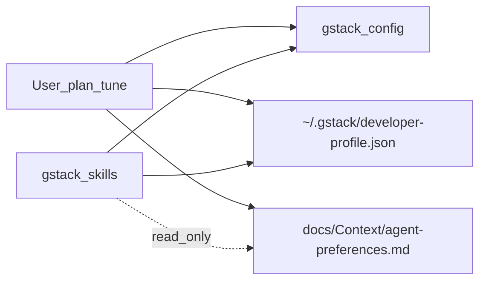

# Spec: DX-01 — gstack /plan-tune setup

> **Story ID:** DX-01
> **GitHub Issue:** N/A (Master-Plan.md source of truth)
> **Epic:** EP-05 — Technical Debt & Infrastructure
> **Status:** 🟨 In Progress
> **Type:** Chore
> **Priority:** P4
> **Estimate:** XS
> **Spec created:** 2026-06-01

---

## Build Scope

✅ Ready to proceed — Scope Boundary

**Files in scope:**

- `~/.gstack/developer-profile.json` (machine-local; never committed)
- gstack config via `~/.claude/skills/gstack/bin/gstack-config`
- `docs/archived/spec-DX-01-gstack-plan-tune.md`
- `docs/AgToosa_TestPlan-DX-01.md`
- `docs/Context/agent-preferences.md` (new)
- `docs/Master-Plan.md` (modified)
- `docs/AgToosa_Changelog.md` (modified)

**Out of scope:**

- `lib/`, `test/`, `pubspec.yaml`
- `docs/PRODUCT-WEDGE.md`
- gstack skill source / question-registry code changes
- Committing `~/.gstack/` into git

---

## 1. Requirements

### 1.1 User Stories

**As a** miToosa maintainer using AgToosa and gstack, **I want** question tuning enabled and a declared developer profile **so that** repeat gstack prompts can be logged and tuned over time.

**As a** future agent session, **I want** repo-visible agent preferences (no secrets) **so that** AgToosa commands align with declared detail/scope bias without reading `~/.gstack` directly.

### 1.2 Acceptance Criteria (EARS)

| ID | EARS | Priority |
|----|------|----------|
| AC-001 | WHEN `/plan-tune` setup completes THE SYSTEM SHALL set `question_tuning` to `true` in gstack config. | Must |
| AC-002 | WHEN setup completes THE SYSTEM SHALL persist all five `declared.*` dimensions in `~/.gstack/developer-profile.json` with `declared_at` ISO timestamp. | Must |
| AC-003 | WHEN an agent runs `gstack-developer-profile --profile` THE SYSTEM SHALL show the five declared values matching the approved profile table. | Must |
| AC-004 | IF repo documentation is in scope THEN THE SYSTEM SHALL add `docs/Context/agent-preferences.md` describing dimensions in plain English (no API keys, no PII). | Should |
| AC-005 | WHILE v1 observational mode is active THE SYSTEM SHALL NOT claim skills auto-adapt from profile beyond per-question `never-ask` / `always-ask` prefs. | Must |

### 1.3 Approved profile values

| Dimension | Value | Interpretation |
|-----------|-------|----------------|
| scope_appetite | 0.5 | Balanced scope |
| risk_tolerance | 0.5 | Balanced risk |
| detail_preference | 0.85 | Verbose — tradeoffs and reasoning |
| autonomy | 0.5 | Balanced consultation/delegation |
| architecture_care | 0.5 | Balanced ship-now vs design-right |

### 1.4 Out of Scope

- Modifying Flutter application code or tests.
- Changing gstack skill implementations or question registry.
- v2 profile-driven skill behavior adaptation.

---

## 2. Design

### 2.1 Architecture Blueprint

Two-layer preference storage:

1. **Machine-local (authoritative for gstack):** `~/.gstack/developer-profile.json` + `gstack-config question_tuning`.
2. **Repo mirror (AgToosa agents):** `docs/Context/agent-preferences.md` — human-readable, no secrets.

### 2.2 STRIDE Threat Model

| Threat | Mitigation |
|--------|------------|
| Information disclosure (profile in git) | Never commit `~/.gstack/`; repo doc has no PII/secrets |
| Tampering (malicious profile) | Local file only; user controls via `/plan-tune` |
| Spoofing | N/A — no server auth |

### 2.3 Data Flow

---

## 3. Tasks

### 3.1 Task Tree

- [x] 1.1 Author spec + approve — _AC-001–005_
- [x] 2.1 `gstack-config set question_tuning true` — _AC-001_
- [x] 2.2 Write declared profile JSON — _AC-002_
- [x] 2.3 Add `docs/Context/agent-preferences.md` — _AC-004_
- [ ] 3.1 QA plan + manual verification — _AC-003, AC-005_
- [ ] 4.1 Ship docs (changelog + complete story) — _DoD_

### 3.2 Definition of Done

- [ ] All Must ACs verified (T-001–T-003 smoke pass)
- [ ] `docs/Context/agent-preferences.md` present with no secrets
- [ ] Master-Plan DX-01 in Completed This Cycle
- [ ] Changelog entry added

---

## ✅ Spec Approved

**Approved:** 2026-06-01  
**Approver:** User (via plan mode + execute request)
